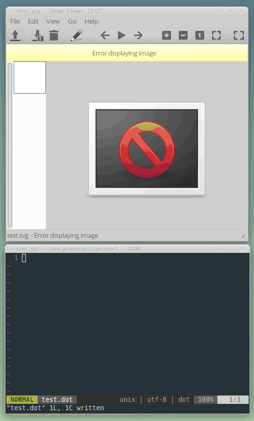
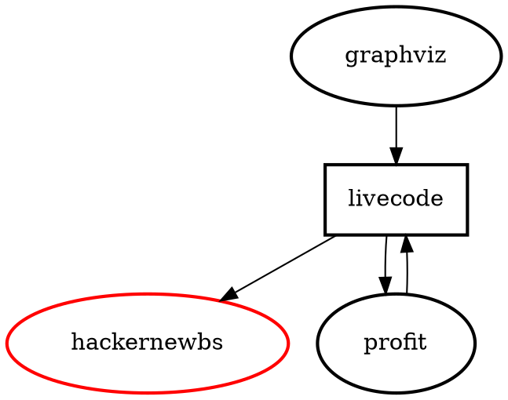
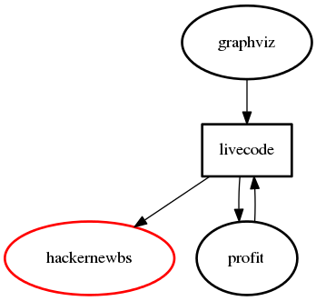

A tiny self-executing Makefile for the live-coding of graphviz `dot` files.

```shell
curl https://chr15m.github.io/graphviz-livecoder/dotlive > ~/bin/dotlive && chmod 755 ~/bin/dotlive
dotlive watch mydotfile.svg
```



### Help

```shell
$ dotlive 
Graphviz live-coding tool.

USAGE:
	dotlive [watch] FILE1.svg [FILE2.png ... ]

ARGS:
	watch     - continuously watch and re-build the named files.
	FILE1.svg - build the file FILE1.svg from FILE1.dot source.
	FILE2.png - build the file FILE1.png from FILE2.dot source.

EXAMPLES:

	# continuously build myfile.svg from myfile.dot
	dotlive watch myfile.svg

	# build (once) myfile.png from myfile.dot
	# and myotherfile.svg from myotherfile.dot
	dotlive myfile.png myotherfile.svg

File type is determined from the target extension.
```

 * [Documentation for the graphviz `dot` format files](http://www.graphviz.org/documentation/).
 * [Graphviz tag on Stackoverflow](https://stackoverflow.com/questions/tagged/graphviz).

### Use

Assuming you have a file called `test.dot` in the current folder:

```shell
dotlive test.png
```

Contents of `test.dot`:



Result:



### Tips

You can provide multiple graph targets. For example if you had `graph1.dot` and `graph2.dot` in the current folder:

```shell
dotlive graph1.svg graph2.svg
```

